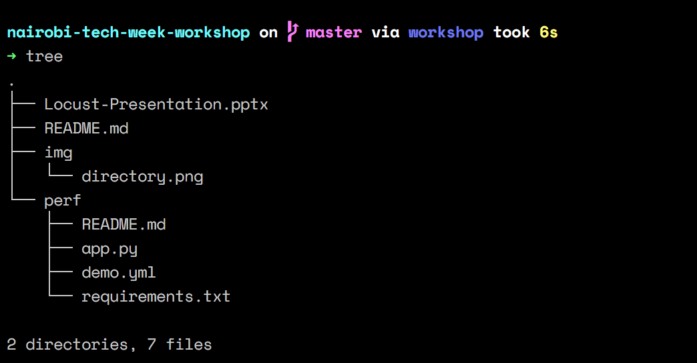

# Performance Testing Workshop
Code for a presentation at the [Nairobi Tech Week](https://nairobitechweek.com/) on [Performance Testing](https://www.wikiwand.com/en/Software_performance_testing) using the :sparkles:coolest:sunglasses::sparkles: tools: [locust](https://locust.io/) and [Taurus](https://gettaurus.org/).

### Installation
You need to have [Python](https://www.python.org/) installed, [Python 3](https://www.python.org/downloads/) preferably, as well as [git](https://git-scm.com/).

Clone this repo, and make it your working directory.

```
git clone git@github.com:clovisphere/nairobi-tech-week-workshop.git && cd nairobi-tech-week-workshop
```

The directory should look like:



(See the **README.md** inside **perf/** for details on how to run the application)

:smiley::wink: enjoy:zzz::ok_hand:
