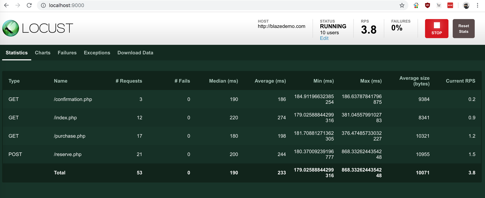
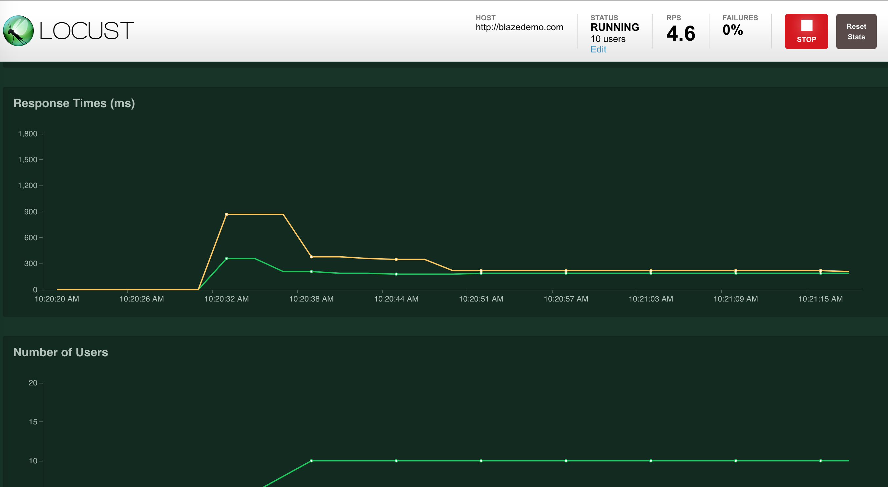
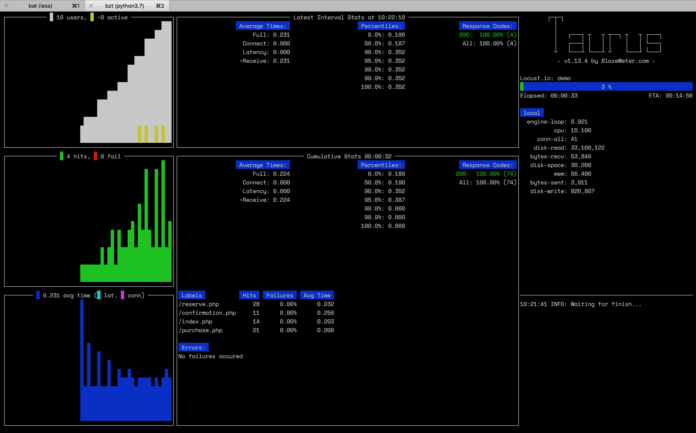

## How To

##### Install Python Packages:

1. Using [pipenv](https://pipenv.readthedocs.io/en/latest/), [virtualenv](https://virtualenv.pypa.io/en/latest/) or [virtualenvwrapper](https://virtualenvwrapper.readthedocs.io/en/latest/) create an environment, and install the required packages.

```
cd perf && pip install -r requirements.txt
```

##### Run:

We will be testing the [Blazemeter Demo App](http://blazedemo.com).

(locust web)
```
locust --host=http://blazedemo.com --port=9000 -f app.py
```



(locust no-web)
```
locust --host=http://blazedemo.com --port=9000 -f app.py --no-web -c 10 -r 1 -t 1m
```

(taurus)
```
bzt demo.yml
```


```
bzt demo.yml -report
```


Use `locust --help` or `bzt --help` to get more information about the command, and all allowed options.
